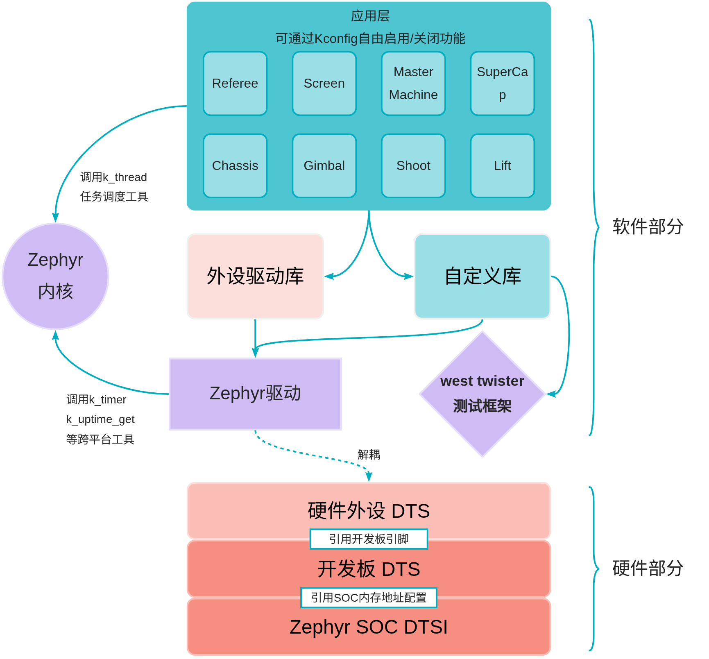

:parent: dev

====================
系统架构设计
====================

核心概念
====================

#. 硬件外设（Peripheral），与MCU引脚直连的物理设备单元，包含传感器、执行器等基础硬件组件。

#. 设备树（DTS, Devicetree Source），硬件描述语言文件，以声明式语法定义芯片外设配置、引脚映射及硬件特性参数。

#. Zephyr内核，基于微控制器的实时操作系统（RTOS），提供任务调度、内存管理等核心功能，类比Linux内核的嵌入式实现。

#. Kconfig配置系统，模块化配置管理机制，通过menuconfig/guiconfig图形界面或prj.conf配置文件实现功能的动态裁剪，支持条件编译与依赖管理。

#. 设备驱动（Driver），基于DTS生成的硬件抽象层，提供标准化的设备操作API（如read/write），实现硬件资源的统一访问接口。

系统示意图
====================

设计理念
====================

软硬件解耦设计
--------------------

实现方案
~~~~~~~~~~~~~~~~~~~~

-  硬件描述与DTS绑定：通过设备树文件声明外设硬件参数（如GPIO引脚、SPI时钟频率等）
-  驱动抽象层构建：利用Zephyr驱动框架自动生成device对象，建立硬件无关的标准化访问接口

核心价值
~~~~~~~~~~~~~~~~~~~~

-  关注点分离
   硬件工程师专注于电路设计与外设选型，软件开发者聚焦算法实现与驱动优化
-  敏捷迭代能力
   采用插件化架构设计，硬件变更仅需调整DTS配置，驱动层无需重构
-  技术纵深拓展
   支持硬件层（如定制开发板设计、高性能IMU集成）与软件层（新型控制算法、通信协议扩展）的独立演进，提升系统上限

测试驱动开发（TDD）
---------------------

实践路径
~~~~~~~~~~~~~~~~~~~~

-  单元测试先行：基于功能需求编写测试用例
-  最小化代码实现：仅满足当前测试用例需求
-  持续重构优化：通过代码审查与静态分析保证代码质量

验证体系
~~~~~~~~~~~~~~~~~~~~

-  本地仿真测试：通过qemu_cortexsoc虚拟平台执行硬件无关逻辑验证
-  自动化测试流水线：集成west twister测试框架与GitHub
   Actions，实现提交级别的回归测试
-  硬件测试：关键模块部署至目标开发板进行物理验证

质量保障优势
~~~~~~~~~~~~~~~~~~~~

-  缺陷预防：测试用例覆盖边界条件与异常场景，降低运行时错误概率
-  架构优化：测试优先原则倒逼模块化设计，提升代码可维护性
-  持续集成：自动化测试流水线确保每次提交的可交付性，降低集成风险

插件式配置管理
--------------------

模块化设计策略
~~~~~~~~~~~~~~~~~~~~

-  功能组件封装为独立库（Library），内含Kconfig配置接口
-  构建时动态装配：通过menuconfig图形界面选择功能模块，自动解析依赖关系
-  配置版本化：关键配置项固化于board.defconf文件，确保硬件兼容性

工程效益
~~~~~~~~~~~~~~~~~~~~

-  资源精细化管控：按需加载功能模块，优化内存与存储占用
-  可维护性提升：显式依赖声明避免隐式耦合，降低技术债务积累

C++编译期优化
---------------------

性能增强策略
~~~~~~~~~~~~~~~~~~~~~

-  元编程技术：应用constexpr计算、模板特化等C++20特性，将运行时决策提前至编译期
-  零成本抽象：通过内联展开和死代码消除，消除算法库中的控制分支

典型应用场景
~~~~~~~~~~~~~~~~~~~~

-  电机控制：PID算法循环中消除浮点运算条件判断
-  传感器融合：卡尔曼滤波器的矩阵运算模板化优化